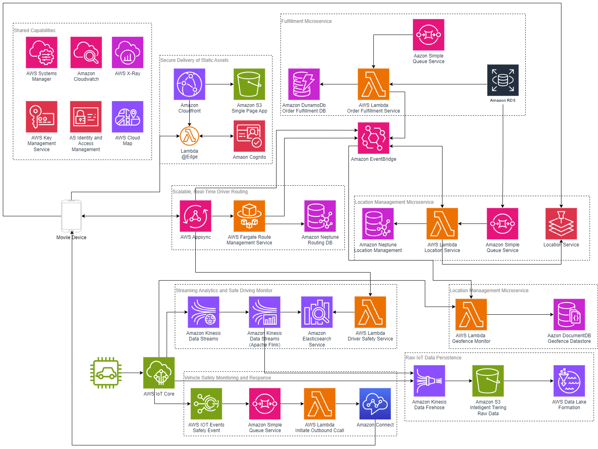
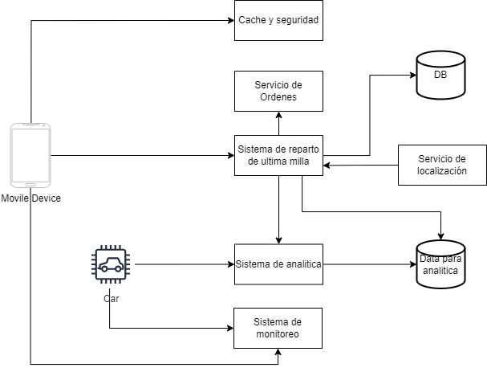

## Tech Lead Challenge

Proyecto FastAPI que aborda tres áreas: Algoritmos y Estructuras de Datos, Diseño y Arquitectura del Sistema, y un ejercicio de Codificación con API REST (cálculo de cotización de pedidos con envío y descuento). Incluye dataset sintético, endpoints documentados y pruebas automatizadas.

---

## 1. Algoritmos y Estructuras de Datos

### 1.1 Pregunta 1 – Top clientes más frecuentes por ventana de tiempo
- **Descripción**: A partir de un dataset de transacciones con `timestamp`, `customer_id`, `amount`, se identifica a los top K clientes más frecuentes dentro de un rango temporal.
- **Implementación**:
  - Lector de CSV en streaming con soporte `.gz`: `app/algorithms/top_customers.py` (función `iter_csv_transactions`).
  - **Modo exacto (memoria)**: `top_k_exact` usa `Counter` + `heapq.nlargest`.
  - **Modo streaming (grandes volúmenes)**: `Misra–Gries` en 2 pasadas (`top_k_from_file_two_pass`):
    1) Encuentra candidatos con memoria acotada.
    2) Recorre nuevamente para contar exactamente solo candidatos.
  - Servicio y heurística de selección: `app/services/analytics.py` decide `exact` vs `stream` según el `mode` solicitado o tamaño del archivo.

- **Complejidad**:
  - Modo exacto: tiempo O(N) para contar + O(M log K) para top-K (M = clientes únicos); espacio O(M).
  - Modo streaming (Misra–Gries + verificación):
    - Pasada 1: O(N · b) amortizado cercano a O(N) con `b = capacidad` pequeña; espacio O(b).
    - Pasada 2: O(N) para contar solo candidatos; espacio O(b).
  - Adecuado para datasets que pueden exceder memoria gracias a la estrategia de dos pasadas y capacidad acotada.

- **Generación creativa del dataset**:
  - Servicio: `app/services/dataset.py` y CLI: `app/scripts/generate_transactions.py`.
  - Características: pesos Zipf-like para simular heavy users, variación de montos, perfiles de cliente (nombre/ciudad/email), y salida `csv`/`csv.gz` en streaming sin cargar todo a RAM.

### 1.2 Pregunta 2 – Índice de rutas de transporte público
- **Descripción**: Se gestiona un conjunto de rutas (cada una con identificador y paradas). Se requiere recuperación eficiente de rutas por parada y mutaciones eficientes (agregar/eliminar paradas).
- **Estructura elegida**: `app/algorithms/transit_routes.py` define `TransitIndex` con dos mapas:
  - `stops_by_route[route_id] -> set(stop_id)`
  - `routes_by_stop[stop_id] -> set(route_id)`
- **Operaciones**:
  - Lectura: `get_routes_by_stop`, `get_stops_by_route` en O(1) promedio.
  - Mutación: `add_route`, `add_stop_to_route`, `remove_stop_from_route`, `remove_route` en O(1) promedio.
- **Justificación**: El doble índice hash mantiene simetría y permite consultas y mutaciones eficientes con conjuntos, evitando duplicados y con costo amortizado constante.

---

## 2. Diseño y Arquitectura del Sistema

### Escenario

Una startup local de reparto de comida a domicilio está experimentando un rápido crecimiento y necesita rediseñar su sistema backend. El sistema actual es una aplicación monolítica que presenta limitaciones en rendimiento, escalabilidad y facilidad de mantenimiento. El objetivo es construir una arquitectura distribuida que soporte el crecimiento, permita integrar nuevas funcionalidades de forma modular y mejore la fiabilidad de la operación.

### Desafíos principales
- **Escalabilidad horizontal**: soportar picos de demanda.
- **Fiabilidad y tolerancia a fallos**: en órdenes y asignación de repartidores.
- **Desac acoplamiento con colas de mensajes**: reducir dependencias temporales.
- **Diseño de APIs claras**: versionadas y fáciles de mantener.
- **Caché**: optimizar consultas frecuentes.
- **Persistencia de datos distribuida**: orientada a casos de uso transaccional, geoespacial y analítica.

### Arquitectura propuesta

Se diseña una arquitectura distribuida basada en microservicios y eventos, con componentes desacoplados:

- **Capa de acceso y seguridad**:
  - Autenticación y autorización centralizadas.
  - CDN y entrega segura de aplicaciones web y móviles.

- **Servicio de órdenes**:
  - Recibe, valida y procesa pedidos.
  - Persistencia en base de datos transaccional.
  - Publica eventos a colas para notificaciones y asignación de repartidores.

- **Sistema de reparto de última milla**:
  - Asignación de repartidores y cálculo de rutas óptimas.
  - Integración con servicio de localización para ETAs.
  - Base de datos de grafos para rutas y ubicaciones.

- **Servicio de localización**:
  - Geolocalización de clientes, comercios y repartidores.
  - Cálculo de rutas, ETAs y geocercas (geofencing).

- **Sistema de analítica y monitoreo operacional**:
  - Ingesta de eventos (órdenes, rutas, estados de entrega).
  - Métricas en tiempo real y tableros; almacenamiento histórico en data lake.

- **Capa de observabilidad**:
  - Métricas, logs y trazas distribuidas para confiabilidad y diagnóstico.

### Flujo del sistema (alto nivel)
1. El cliente (web/móvil) se autentica.
2. El servicio de órdenes registra el pedido en la base transaccional.
3. Se emite un evento a la cola para notificar al sistema de última milla.
4. Última milla consulta localización, estima rutas y asigna repartidor.
5. Analítica consume eventos en tiempo real (órdenes, asignaciones, entregas) para generar métricas.
6. Observabilidad traza el flujo end-to-end y levanta alertas ante fallos o retrasos.

### Diagramas
**Arquitectura Detallada**  


**Diagrama de Contexto**  


Con esta arquitectura, el sistema evoluciona de un monolito rígido a un ecosistema distribuido, desacoplado y tolerante a fallos, preparado para el crecimiento y la incorporación ágil de nuevas funcionalidades sin afectar la operación existente.

## 3. Codificación y Resolución de Problemas (API REST)

### 3.1 Endpoint de cotización de pedido
- Ruta: `POST /api/v1/orders/quote`
- Request (`OrderRequest`):
  - `stratum`: 1..6 (sistema de estratos en Colombia)
  - `items[]`: lista de objetos `{ sku, price, quantity }`
- Lógica (`app/services/pricing.py`):
  - `subtotal = sum(price * quantity)`
  - Envío base configurable (`delivery_base_fee`) ajustado por estrato con multiplicador: estratos altos pagan un poco más/menos según regla del ejemplo.
  - Descuento si `subtotal >= discount_threshold` con `discount_rate`.
  - `total = subtotal + shipping - discount` (no negativo).
- Response (`OrderResponse`): `{ subtotal, shipping, discount, total }`.

Ejemplo:

```json
POST /api/v1/orders/quote
{
  "stratum": 3,
  "items": [
    {"sku": "A", "price": 10000, "quantity": 3}
  ]
}
```

```json
200 OK
{
  "subtotal": 30000,
  "shipping": 5000,
  "discount": 0,
  "total": 35000
}
```

### 3.2 Endpoints de Analítica y Dataset
- `POST /api/v1/analytics/top-customers` (`TopCustomersRequest`):
  - Parámetros: `path`, ventana de tiempo (`days` o `start`/`end`), `top_customers`, `mode` (`auto|exact|stream`), `capacity`.
  - Devuelve `results[]` con `customer_id` y `count`, `mode` utilizado y timestamps.

- `POST /api/v1/datasets/transactions/generate` (`DatasetGenRequest`):
  - Genera CSV/CSV.GZ sintético con campos: `timestamp, customer_id, amount, customer_name, customer_city, customer_email`.
  - Devuelve ruta de salida y metadatos.

### 3.3 Endpoints de Rutas de Transporte
- `POST /api/v1/transit/routes` crea ruta.
- `GET /api/v1/transit/routes/{route_id}/stops` consulta paradas por ruta.
- `POST /api/v1/transit/routes/{route_id}/stops` agrega parada.
- `DELETE /api/v1/transit/routes/{route_id}/stops/{stop_id}` elimina parada.
- `GET /api/v1/transit/stops/{stop_id}/routes` consulta rutas por parada.
- `DELETE /api/v1/transit/routes/{route_id}` elimina ruta.
- `GET /api/v1/transit/routes` lista rutas.
- `GET /api/v1/transit/stops` lista paradas.
- `GET /api/v1/transit/routes-with-stops` todas las rutas con sus paradas.

---

## Cómo ejecutar el proyecto

### Opción A) Local (sin Docker)
1. Requisitos: Python 3.11+ y `pip`.
2. Instalar dependencias:
   - `pip install -r requirements.txt`
3. Ejecutar la API:
   - `uvicorn app.main:app --reload`
4. Abrir documentación interactiva:
   - Swagger UI: `http://127.0.0.1:8000/docs`
   - Healthcheck: `http://127.0.0.1:8000/health`

### Opción B) Docker / Docker Compose
1. Construir y levantar:
   - `docker compose up --build`
2. API disponible en `http://localhost:8000`
3. Volúmenes mapeados: `./app -> /app/app` y `./data -> /app/data`.

### Variables de entorno (pricing)
Configurar en `.env` si desea cambiar reglas:
- `DELIVERY_BASE_FEE` (por defecto 5000)
- `DISCOUNT_THRESHOLD` (por defecto 100000)
- `DISCOUNT_RATE` (por defecto 0.05)

---

## Cómo probar

### Pruebas unitarias y de API
- Ejecutar todas las pruebas:
  - `pytest -q`
- Cobertura:
  - `pytest --cov=app -q`
- Con Docker Compose (dentro del contenedor):
  - `docker compose exec api sh -lc "pytest -q"`

### Probar endpoints manualmente
- Cotización:
  - `POST http://localhost:8000/api/v1/orders/quote`
- Top customers (usando dataset por defecto en `/app/data/transactions.csv.gz`):
  - `POST http://localhost:8000/api/v1/analytics/top-customers`
- Generar dataset:
  - `POST http://localhost:8000/api/v1/datasets/transactions/generate`
- Rutas de transporte (CRUD y consultas): ver rutas en sección 3.3 o Swagger UI.

---

## Estructura del proyecto (carpetas principales)
- `app/main.py`: instancia FastAPI y health.
- `app/api/v1/routes.py`: definición de endpoints.
- `app/services/*`: lógica de dominio (pricing, analytics, dataset, transit).
- `app/algorithms/*`: algoritmos puros (top customers, índice de rutas).
- `app/schemas/*`: contratos de entrada/salida con `pydantic`.
- `app/tests/*`: pruebas unitarias y de endpoints.
- `data/`: datasets de ejemplo/salida.

---

## Buenas prácticas aplicadas
- Validación de datos con `pydantic` (request/response), tipado estático.
- Separación de capas (API/servicios/algoritmos/esquemas).
- Endpoints versionados y códigos de estado adecuados (`400/404/409`).
- Pruebas automatizadas con `pytest` y `TestClient`.
- Lectura/escritura en streaming para datasets grandes.

